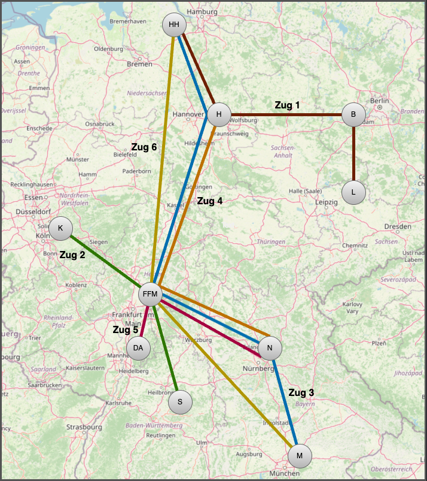

[© 2025, Alexander Voß, FH Aachen, codebasedlearning.dev](mailto:info@codebasedlearning.dev)

# Task `Service Stations`

Ein Eisenbahnunternehmen plant, sein Netzwerk auszubauen, und benötigt 
dafür Servicestationen entlang der Strecken, um alle Züge mit Gütern
wie Lebensmittel oder Getränke zu versorgen. 
Jeder Zug muss auf seiner Strecke mindestens eine Servicestation anfahren. 

> Sie sollen ein Programm entwickeln, das anhand der vorgegebenen 
Streckenpläne die minimale Anzahl und die Standorte der benötigten 
Servicestationen bestimmt, ohne die Streckenführung zu ändern oder 
zusätzliche Haltestellen einzuführen. Ziel ist es, die Kosten durch 
eine **minimale Anzahl** von Servicestationen zu senken.

(Abschlussprüfung MATSE)

Die Zugverbindungen, definiert durch die Bahnhöfe, die sie verbinden, 
sind aus einer Textdatei einzulesen. Jede Verbindung enthält mindestens 
zwei Bahnhöfe. Züge fahren immer dieselbe Strecke in beide Richtungen, und 
die Platzierung einer Servicestation an einem Bahnhof ermöglicht 
die Versorgung aller dort haltenden Züge, weswegen die Servicestationen
immer auch im Bahnhof und nicht irgendwo auf der Strecke liegen.

Beispiel: Eine Zugverbindung, die Hamburg (HH), Hannover (H), Berlin (B) 
und Leipzig (L) verbindet, ist diese: 

`Zug 1 = {HH, H, B, L}`

Der gesamte Fahrplan könnte so aussehen:
```
Zug 1 = {HH, H, B, L}
Zug 2 = {K, FFM, S}
Zug 3 = {HH, H, FFM, N, M}
Zug 4 = {H, FFM, N}
Zug 5 = {DA, FFM, N}
Zug 6 = {HH, FFM, M}
```

Die zugehörige Eingabedatei sieht so aus:

```
# Beispiel 1
HH,H,B,L
K,FFM,S
HH,H,FFM,N,M
H,FFM,N
DA,FFM,N
HH,FFM,M
```

Wobei hier die weiteren Städte Frankfurt am Main (FFM), Köln (K), Stuttgart (S),
Nürnberg (N), Darmstadt (DA) und München (M) ebenfalls über verschiedene Züge 
miteinander verbunden sind.
`#` kennzeichnet eine Kommentarzeile.



Eine mögliche Lösung in diesem Beispiel sind Servicestationen
in den Bahnhöfen '{H, FFM}'. So sind alle Züge versorgt.

Die Berechnung und die Ausgabe **einer** Lösungsinstanz sind ausreichend,
d.h. bei mehreren möglichen Lösungen für das Problem genügt es, 
eine gültige Lösung auf die Konsole auszugeben.

Die Ausgabe sieht so aus:

```
Servicestationen in: H;FFM
```

## Reduktion

Für die Berechnung der Anzahl und Standorte der Servicestationen 
sollen Datenreduktionstechniken angewendet werden, ohne die Korrektheit 
der Lösungen zu beeinträchtigen. Die Eingabedaten sollen vor 
der Berechnung einer Lösung minimiert werden.
Die Lösung für den reduzierten Datensatz muss auch für den 
vollständigen Datensatz gültig sein.

Bahnhöfe sind durch Kürzel des Stadtnamens eindeutig benannt, 
und es wird angenommen, dass jede Stadt nur einen Bahnhof hat.


## Datenreduktionstechnik 1

Mehrfach vorkommende Bahnhöfe können bis auf einen reduziert werden.

### Vor Datenreduktion 1

```
    { HH; H; K; HH }
```

Hier ist ein Bahnhof "HH" ausreichend.

### Nach Datenreduktion 1

```
    { HH; H; K }
```


## Datenreduktionstechnik 2 

Diese sieht vor, die Anzahl der Bahnhöfe zu reduzieren, 
indem Bahnhöfe aus der Liste entfernt werden, wenn alle Züge, 
die an einem Bahnhof A halten, auch an einem Bahnhof B halten. 

Wenn dies zutrifft, kann Bahnhof A aus der Liste der Bahnhöfe 
und den Zugverbindungen entfernt werden. 

Ein Beispiel hierfür ist, dass alle Züge, die in DA halten, 
auch in H halten, sodass DA entfernt werden darf. 

### Vor Datenreduktion 2

```
    { S; DA; H; K }
    { FFM; DA; H; K }
    { M; DA; H; B }
    { C; M; H; E }
```

### Nach Datenreduktion 2

```
    { S; H; K }
    { FFM; H; K }
    { M; H; B }
    { C; M; H; E }
```

Die umgekehrte Situation, dass alle Züge, die in H halten, 
auch in DA halten, trifft nicht zu; deshalb kann nur DA, 
nicht aber H entfernt werden.


## Datenreduktionstechnik 3

Datenreduktionstechnik 3 ermöglicht die Reduktion der Zugverbindungen 
nach folgender Regel: Wenn ein Zug an allen Bahnhöfen hält, 
an denen auch ein anderer Zug hält, kann der erste Zug aus der Liste der Züge 
entfernt werden. 

Im Beispiel sind alle Bahnhöfe des zweiten Zuges auch in der ersten Zugverbindung
enthalten, weshalb der erste Zug entfernt werden darf.

### Vor Datenreduktionstechnik 3

```
    { S; DA; H; K; M }
    { DA; H }
    { M; N; DA; B }
    { C; M; E }
```

### Nach Datenreduktionstechnik 3

```
    { DA; H }
    { M; N; DA; B }
    { C; M; E }
```

### Hinweise

- Abhängig von der Implementierung des Lösungsalgorithmus ist es möglich, 
dass durch die Anwendung von Datenreduktionstechniken eine andere korrekte Lösung 
gefunden wird.

- Erzeugen Sie eigene Eingabedateien unterschiedlicher Größe, um die Effizienz 
des Algorithmus zur Berechnung der Anzahl und Position der Servicestationen 
sowie der Datenreduktionstechniken zu analysieren.
Um große Testdatensätze zu erzeugen, kann ein vorhandenes Beispiel 
(bei gleichbleibender Lösungsmenge) jederzeit durch Umkehrung der 
Datenreduktionstechniken vergrößert werden.


## Weitere Beispiele

Im Ordner 'data' finden Sie weitere Beispiele.


## Aufgabe

Implementieren Sie unter Einhaltung der beschriebenen Randbedingungen ein Program, das anhand der vorgegebenen Streckenpläne die minimale Anzahl und die Standorte der benötigten Servicestationen bestimmt.

Viel Erfolg!
